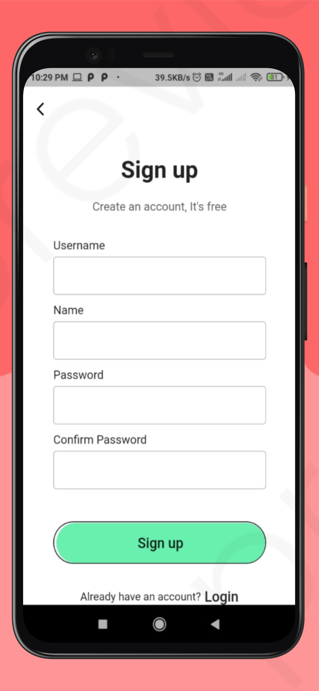
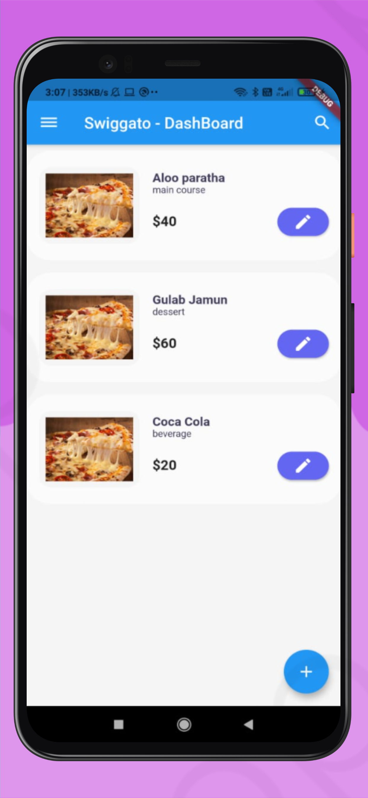
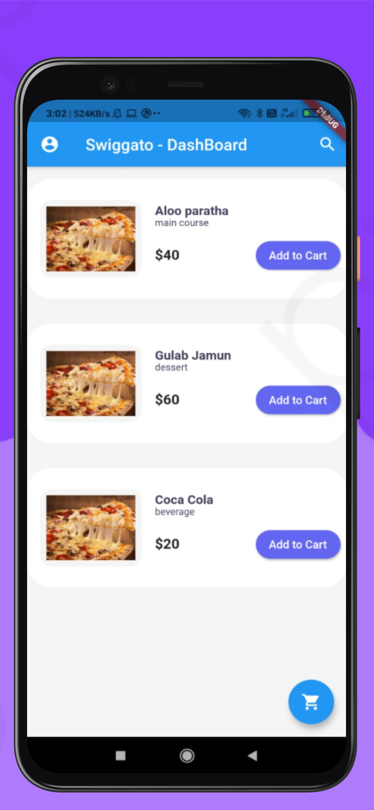
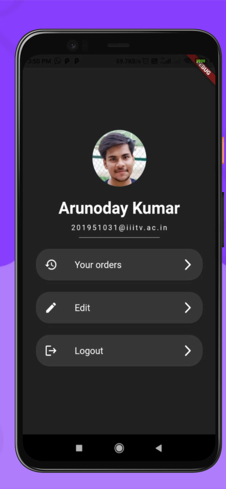
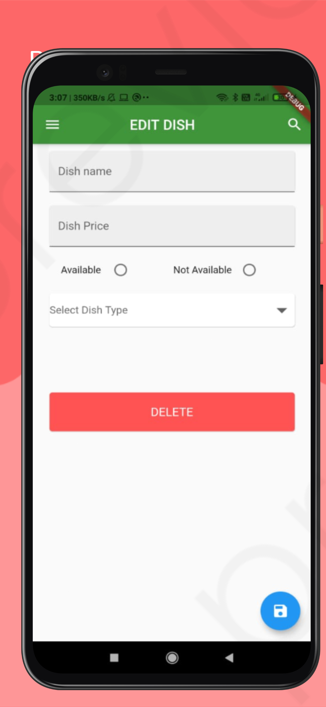
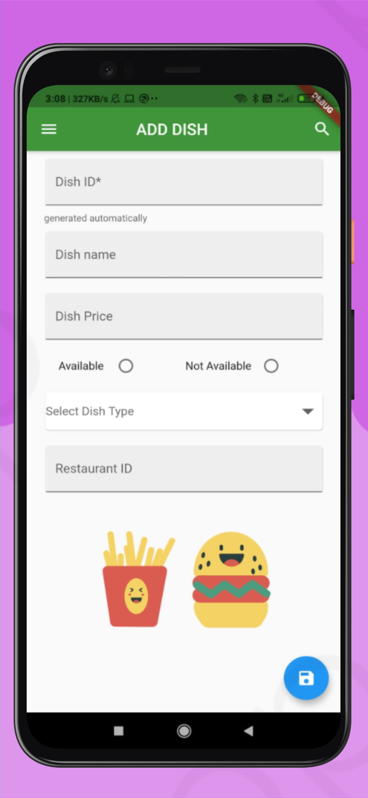

# Flutter Food ordering App 
We have made a food ordering system. It will help the restaurant to do all the functionalities more accurately and in a faster way and to maintain records, as many restaurants do that in a manual way. Users will register and log in to the system then place an order from the menu of the restaurant the app will manage all the processes of taking the order, payment, and process the order. Users can also view order history and edit their profile details. The admin can add and edit food items and can view the order details.

 

# 💻Tech Stack Used
- Frontend - Flutter
- Backend - NodeJS
- Database - MySQL

 

# ✨ Requirements
- Any Operating System (ie. MacOS X, Linux, Windows) with MySQL installed for the respective OS
- Any IDE with Flutter SDK installed (ie. Android Studio, VSCode, IntelliJ, etc)
- Mysql Workbench

 

# 📝Steps to run
 

1. Clone this repository, using `git clone https://github.com/nirala96/Food-Ordering-App.git`

2. open in Android studio and run `pub get`
3. change the IP in `lib/services` to your system IP.
4. Setup server [(Refer here for further setup)](https://github.com/nirala96/Food-Ordering-App-Server/blob/main/README.md)
5. Set up an android emulator or your android device and run.😊

 

# 🤓 Contributers
- [Arunoday Kumar](https://github.com/nirala96)
- [Ashish Kumar Singh](https://github.com/AshishSingh2001)
- [Kapil Kumar](https://github.com/kapilkumar2001)
- [Shivam Malpani](https://github.com/shivam0110)

# Screenshots

### ⚡ Login - Signup
 

    </img> </img> </img> 

 
 

### ⚡ Menu Page(Admin and User)
 

    </img> </img> 

 
 

### ⚡ Profile Screen
 

    </img> </img> 

 
 

### ⚡ Forms (DishEdit - DishAdd - ProfileEdit)
 

    </img> </img> </img> 

 
 

### ⚡ Working App (User Side - Admin Side)
 
</img>
</img>
 
 

☕

